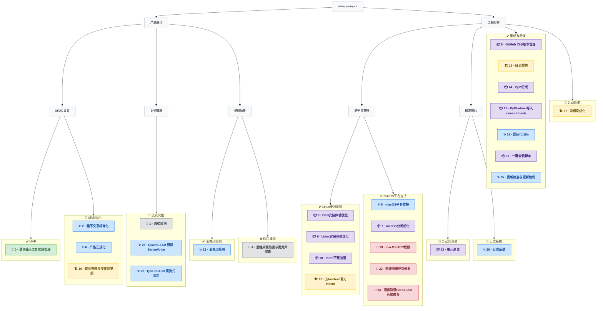

# 开发树

## 分类图例

| 图标 | 类型 | 说明                       |
| ---- | ---- | -------------------------- |
| 🌱   | 初建 | 某功能域首次从零建立       |
| ✨   | 功能 | 扩展用户可感知的能力       |
| 🐛   | 修复 | 纠正缺陷或回归             |
| 🏗️   | 重构 | 内部结构改善，用户行为不变 |
| 📦   | 工程 | 打包/CI/分发/工具链        |
| 🔬   | 探索 | 调研，可能被搁置           |

---

## 可视化

---

## 节点索引

> 最后更新：2026-04-25 | 共 28 轮

| #   | 名称                      | 类型    | 所属 Epic     | 一句话描述                                                                                 |
| --- | ------------------------- | ------- | ------------- | ------------------------------------------------------------------------------------------ |
| 0   | 语音输入工具初始实现      | 🌱 初建 | MVP           | 实现双引擎（本地 SenseVoice + 云端豆包）Linux 语音输入工具，evdev 监听热键，剪贴板粘贴文字 |
| 1   | 流式识别                  | 🔬 探索 | 流式识别      | 探索 SenseVoice/Paraformer 流式识别，因伪影与质量问题搁置                                  |
| 2   | 程序交互标准化            | ✨ 功能 | UI/UX优化     | 将程序改造为带系统托盘和 Web 设置页的 Ubuntu 桌面应用，支持 DEB 安装                       |
| 3   | DEB安装体验优化           | 📦 工程 | Linux安装加速 | 将依赖安装与模型下载移至首次启动，用 tkinter 进度窗口统一展示                              |
| 4   | 远程桌面热键与麦克风探索  | 🔬 探索 | 远程桌面      | 探索远程桌面热键方案，evdev 与 ToDesk 不兼容，无音频转发故搁置                             |
| 5   | macOS平台支持             | ✨ 功能 | macOS平台支持 | 将工具移植到 macOS，实现平台抽象、Helper App TCC 授权和多平台设备优先级选择                |
| 6   | 产品正规化                | ✨ 功能 | UI/UX优化     | 引入状态驱动 UI、实时波形浮窗和版本号展示，完善双平台用户体验                              |
| 7   | macOS分发优化             | 📦 工程 | macOS平台支持 | 捆绑 python-build-standalone、嵌套 .app 实现 TCC 归因，并实现三阶段安装窗口                |
| 8   | GitHub CI与版本管理       | 📦 工程 | 集成与分发    | 建立 GitHub Actions 双平台并行构建、自动版本管理和 PyPI 发布流程                           |
| 9   | Linux安装体验优化         | 📦 工程 | Linux安装加速 | 将 Linux 安装体验对齐 macOS，首次启动自动安装依赖和下载模型                                |
| 10  | torch下载加速             | 📦 工程 | Linux安装加速 | 自动检测 GPU 并通过阿里云镜像分发 CUDA/CPU 版 torch，提升安装速度                          |
| 12  | 去torch-iic官方ONNX       | 🏗️ 重构 | Linux安装加速 | 从 torch FunASR 迁移至 ModelScope 官方 ONNX SenseVoice，彻底去除 PyTorch 依赖              |
| 13  | 目录重构                  | 🏗️ 重构 | 集成与分发    | 改造为 src layout，引入 hatchling 构建后端和 importlib.resources，消除路径魔法             |
| 14  | PyPI分发                  | 📦 工程 | 集成与分发    | 完成 PyPI 发布链路，删除全部打包/DEB 基础设施，建立 Trusted Publishing 自动发布            |
| 15  | 单元测试                  | 📦 工程 | 自动化测试    | 建立 75 个测试用例（51% 覆盖率）、跨平台 fake 模块和 CI codecov 集成                       |
| 16  | 架构整理与浮窗视觉统一    | 🏗️ 重构 | UI/UX优化     | 将托盘逻辑下沉至 backends，重设计胶囊形浮窗动画，外化 HTML 模板                            |
| 17  | PyPI-wheel写入commit-hash | 📦 工程 | 集成与分发    | 实现 hatchling 构建钩子，在 PyPI wheel 中自动注入 git commit hash                          |
| 18  | 国际化i18n                | ✨ 功能 | 集成与分发    | 为设置页、CLI、托盘菜单和 HTML UI 添加中英法三语支持，零成本切换                           |
| 19  | macOS-TCC权限             | 🐛 修复 | macOS平台支持 | 编写 Objective-C 原生启动器（dlopen Python），自动生成 .app 并自签名解决 TCC 归因问题      |
| 20  | 日志系统                  | ✨ 功能 | 日志系统      | 集成 structlog，实现平台专属日志目录、launchd stderr 分离和设置 UI 日志级别控制            |
| 21  | 一键安装脚本              | 📦 工程 | 集成与分发    | 创建支持 macOS/Linux 的 bash 安装脚本，含语言选择、uv/系统依赖安装和 --init 集成           |
| 22  | 热键回调死锁修复          | 🐛 修复 | macOS平台支持 | 修复 macOS CGEventTap 回调内调用 AudioUnitStop 导致的死锁，改为异步事件队列处理            |
| 23  | 麦克风检测                | ✨ 功能 | 麦克风检测    | 设置页集成麦克风检测，Web Audio API 实时波形 + MediaRecorder 录音回放，浏览器端纯前端实现  |
| 24  | 退出路径CoreAudio死锁修复 | 🐛 修复 | macOS平台支持 | 主动 Pa_Terminate + unregister atexit + 超时兜底 os._exit，消除退出阶段 CoreAudio HAL 死锁 |
| 25  | 更新检查与更新触发        | ✨ 功能 | 集成与分发    | 设置页新增 PyPI 更新检查 + 一键 `uv tool upgrade`，迭代删掉 install_method 探测简化到 85 行 |
| 26  | Qwen3-ASR 替换 SenseVoice | ✨ 功能 | 流式识别      | 从 SenseVoice 迁移到 Qwen3-ASR int8 ONNX（0.6B/1.7B 可热切换），识别质量从关键词匹配跃迁到原文零错字，为后续流式识别奠基 |
| 27  | 冷启动优化                | 🏗️ 重构 | 启动性能      | 用 `modelscope.snapshot_download(local_files_only=True)` 跳过 manifest 校验 + 损坏文件兜底重下，cache 命中冷启动从 ~5s 压到 ~2.9s |
| 28  | Qwen3-ASR 真流式识别       | ✨ 功能 | 流式识别      | 用 prefix-cached re-prefill (策略 E) + marker-anchored rollback 切分实现按住热键边说边出字，每 ~2s 出新字段，与离线 edit distance ≤ 5% |

---

## Epic 结构

> 由作者手动维护。AI 只负责「可视化」和「节点索引」两个区块。

### 产品设计

#### UI/UX 设计

##### MVP

- 状态：已完成
- 轮次：0

##### UI/UX优化

- 状态：进行中
- 轮次：2, 6, 16

#### 识别效果

##### 流式识别

- 状态：进行中
- 轮次：1, 26, 28

#### 使用场景

##### 麦克风检测

- 状态: 已完成
- 轮次：23

##### 远程桌面

- 状态：已放弃
- 轮次：4

### 工程架构

#### 跨平台支持

##### Linux安装加速

- 状态：已完成
- 轮次：3, 9, 10, 12

##### macOS平台支持

- 状态：已完成
- 轮次：5, 7, 19, 22, 24

#### 集成与分发

- 状态：已完成
- 轮次：8, 13, 14, 17, 18, 21, 25

#### 启动性能

- 状态：进行中
- 轮次：27

#### 研发规范

##### 自动化测试

- 状态：进行中
- 轮次：15

##### 日志系统

- 状态：进行中
- 轮次：20
